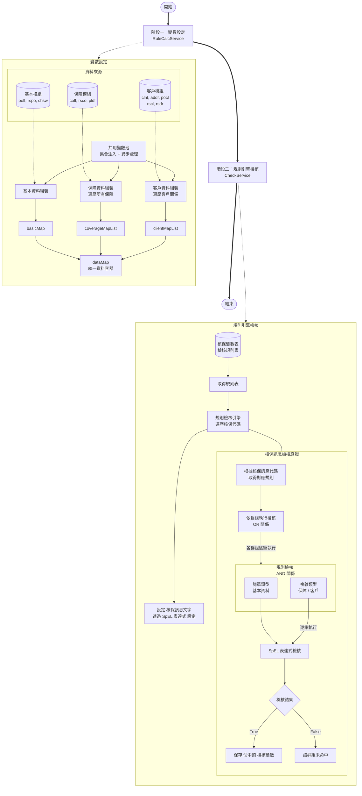

# 啟動
- http://localhost:9010/swagger-ui/index.html

# DB 操作頁面
- http://localhost:9010/h2-console

# 簡易流程圖

```mermaid
graph TB
    %% 主流程
    Start([開始]) ==> Phase1[階段一：變數設定<br/>RuleCalcService]
    Phase1 ==> Phase2[階段二：規則引擎檢核<br/>CheckService]
    Phase2 ==> End([結束])

    %% ===== 階段一：變數設定 =====
    subgraph Phase1Detail["變數設定"]
        direction TB
        
        %% 資料來源
        subgraph DataSources["資料來源"]
            direction LR
            DB1[(基本模組<br/>polf, rspo, chsw)]
            DB2[(保障模組<br/>colf, rsco, pldf)]
            DB3[(客戶模組<br/>clnt, addr, pocl<br/>rscl, rsdr)]
        end
        
        %% 共用變數處理
        Common[共用變數池<br/>集合注入 + 異步處理]
        
        %% 三大資料組裝模組
        M1[基本資料組裝]
        M2[保障資料組裝<br/>遍歷所有保障]
        M3[客戶資料組裝<br/>遍歷客戶關係]
        
        %% 輸出容器
        basicMap[basicMap]
        coverageMapList[coverageMapList]
        clientMapList[clientMapList]
        dataMapContainer[dataMap<br/>統一資料容器]
        
        %% 連接關係
        DB1 -..-> M1
        DB2 -..-> M2
        DB3 -..-> M3
        
        Common --> M1 & M2 & M3
        
        M1 --> basicMap
        M2 --> coverageMapList
        M3 --> clientMapList
        
        basicMap & coverageMapList & clientMapList --> dataMapContainer
    end

    %% ===== 階段二：規則引擎檢核 =====
    subgraph Phase2Detail["規則引擎檢核"]
        direction TB
        
        %% 規則來源
        DB4[(核保變數表<br/>檢核規則表)]
        S1[取得規則表]
        DB4 -.-> S1
        
        %% 主要檢核流程
        S2[規則檢核引擎<br/>遍歷核保代碼]
        S3[設定 核保訊息文字 <br> 透過 SpEL 表達式 設定]
        S1 --> S2 --> S3
        
        %% 檢核細節
        subgraph S2Detail["核保訊息檢核邏輯"]
            direction TB
            
            L1[根據核保訊息代碼<br/>取得對應規則]
            L2[依群組執行檢核<br/>OR 關係]
            
            subgraph RuleTypes["規則檢核 <br> AND 關係"]
                direction LR
                L3[簡單類型<br/>基本資料]
                L4[複雜類型<br/>保障 / 客戶]
            end
            
            SP1[SpEL 表達式檢核]
            Result{檢核結果}
            ResultTrue[保存 命中的 檢核變數]
            ResultFalse[該群組未命中]
            
            L1 --> L2
            L2 -->|各群組逐筆執行| RuleTypes
            L3 --> SP1
            L4 -->|逐筆執行| SP1
            SP1 --> Result
            Result -->|True| ResultTrue
            Result -->|False| ResultFalse
        end
        
        S2 --- S2Detail
    end

    %% 主流程與細節連接
    Phase1 -.-> Phase1Detail
    Phase2 -..-> Phase2Detail
```

