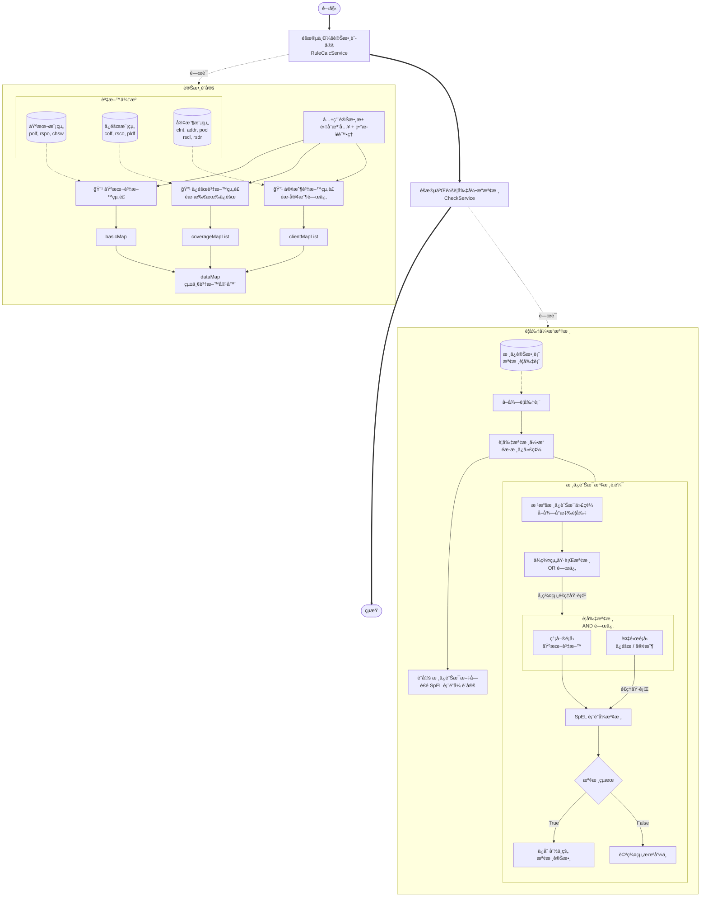

# å•Ÿå‹•
- http://localhost:9010/swagger-ui/index.html

# DB æ“作é é¢
- http://localhost:9010/h2-console

# 簡易æµç¨‹åœ–

```mermaid
graph TB
    %% 主æµç¨‹
    Start([開始]) ==> Phase1[éšæ®µä¸€ï¼šè®Šæ•¸è¨­å®š<br/>RuleCalcService]
    Phase1 ==> Phase2[éšæ®µäºŒï¼šè¦å‰‡å¼•æ“檢核<br/>CheckService]
    Phase2 ==> End([çµæŸ])

    %% ===== éšæ®µä¸€ï¼šè®Šæ•¸è¨­å®š =====
    subgraph Phase1Detail["變數設定"]
        direction TB
        
        %% 資料來æº
        subgraph DataSources["資料來æº"]
            direction LR
            DB1[(基本模組<br/>polf, rspo, chsw)]
            DB2[(ä¿éšœæ¨¡çµ„<br/>colf, rsco, pldf)]
            DB3[(客戶模組<br/>clnt, addr, pocl<br/>rscl, rsdr)]
        end
        
        %% 共用變數處ç†
        Common[共用變數池<br/>集åˆæ³¨å…¥ + 異步處ç†]
        
        %% 三大資料組è£æ¨¡çµ„
        M1[🔹 基本資料組è£]
        M2[🔹 ä¿éšœè³‡æ–™çµ„è£<br/>é歷所有ä¿éšœ]
        M3[🔹 客戶資料組è£<br/>é歷客戶關係]
        
        %% 輸出容器
        basicMap[basicMap]
        coverageMapList[coverageMapList]
        clientMapList[clientMapList]
        dataMapContainer[dataMap<br/>統一資料容器]
        
        %% 連æ¥é—œä¿‚
        DB1 -.-> M1
        DB2 -.-> M2
        DB3 -.-> M3
        
        Common --> M1 & M2 & M3
        
        M1 --> basicMap
        M2 --> coverageMapList
        M3 --> clientMapList
        
        basicMap & coverageMapList & clientMapList --> dataMapContainer
    end

    %% ===== éšæ®µäºŒï¼šè¦å‰‡å¼•æ“檢核 =====
    subgraph Phase2Detail["è¦å‰‡å¼•æ“檢核"]
        direction TB
        
        %% è¦å‰‡ä¾†æº
        DB4[(æ ¸ä¿è®Šæ•¸è¡¨<br/>檢核è¦å‰‡è¡¨)]
        S1[å–å¾—è¦å‰‡è¡¨]
        DB4 -.-> S1
        
        %% 主è¦æª¢æ ¸æµç¨‹
        S2[è¦å‰‡æª¢æ ¸å¼•æ“<br/>éæ­·æ ¸ä¿ä»£ç¢¼]
        S3[設定 æ ¸ä¿è¨Šæ¯æ–‡å­— <br> é€é SpEL 表é”å¼ è¨­å®š]
        S1 --> S2 --> S3
        
        %% 檢核細節
        subgraph S2Detail["æ ¸ä¿è¨Šæ¯æª¢æ ¸é‚輯"]
            direction TB
            
            L1[根據核ä¿è¨Šæ¯ä»£ç¢¼<br/>å–å¾—å°æ‡‰è¦å‰‡]
            L2[ä¾ç¾¤çµ„執行檢核<br/>OR 關係]
            
            subgraph RuleTypes["è¦å‰‡æª¢æ ¸ <br> AND 關係"]
                direction LR
                L3[ç°¡å–®é¡å‹<br/>基本資料]
                L4[複雜é¡å‹<br/>ä¿éšœ / 客戶]
            end
            
            SP1[SpEL 表é”å¼æª¢æ ¸]
            Result{檢核çµæœ}
            ResultTrue[ä¿å­˜ 命中的 檢核變數]
            ResultFalse[該群組未命中]
            
            L1 --> L2
            L2 -->|å„群組é€ç­†åŸ·è¡Œ| RuleTypes
            L3 --> SP1
            L4 -->|é€ç­†åŸ·è¡Œ| SP1
            SP1 --> Result
            Result -->|True| ResultTrue
            Result -->|False| ResultFalse
        end
        
        S2 --- S2Detail
    end

    %% 主æµç¨‹èˆ‡ç´°ç¯€é€£æ¥
    Phase1 -.é—œè¯.-> Phase1Detail
    Phase2 -.é—œè¯.-> Phase2Detail
```
